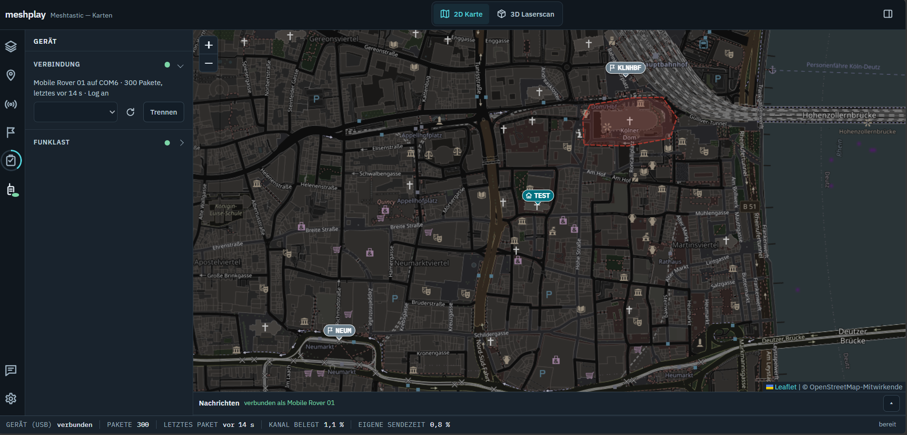
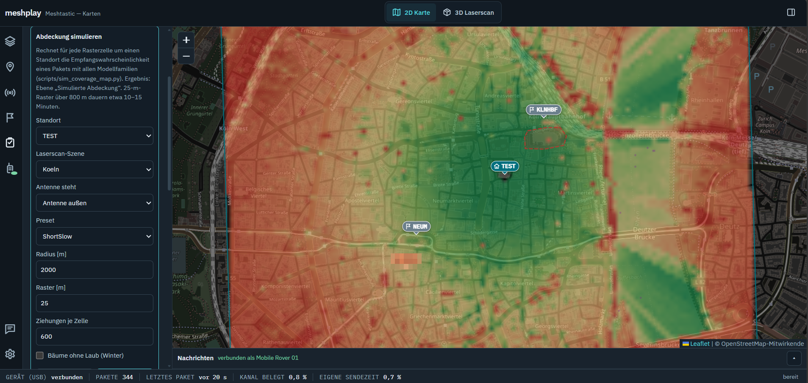
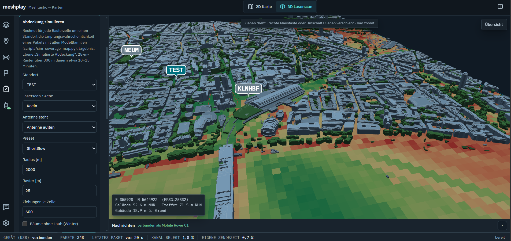
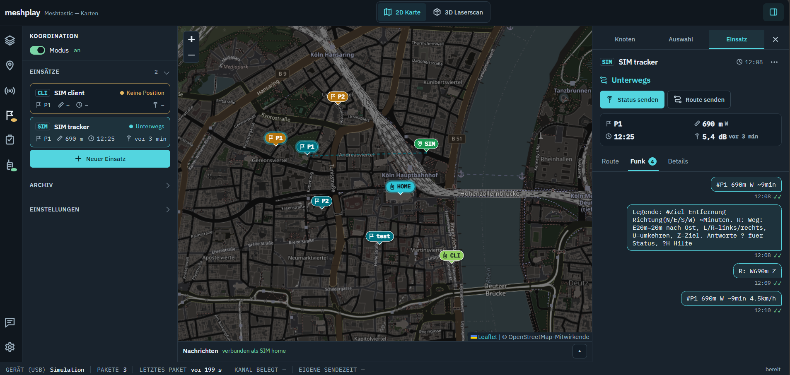
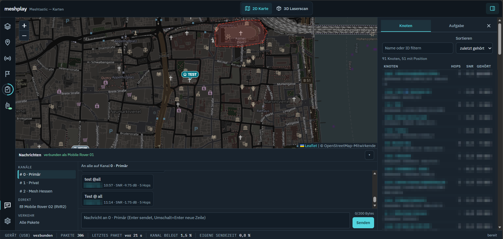

# meshplay

**A map app and toolbox for your [Meshtastic](https://meshtastic.org) node: see your mesh,
measure and simulate where your radio reaches, and guide people in the field.**

Connect a Meshtastic node over USB, open the map in your browser, and you get the mesh live on
a 2D map or a 3D city model built from laser-scan data. It started with one question —
*where can my home node actually be reached?* — and answers it two ways: by measuring on a
walk, and by simulating the radio links over every building and tree.



## Features

| | |
|---|---|
| 🗺️ **Live map** | Every node your device hears, on OpenStreetMap or in 3D; a sortable node list with signal, hops and battery; traceroute and position request with one click. |
| 💬 **Messages** | Read and send on your channels or directly to a node; delivery state for each message; the packet traffic as it arrives. |
| 🚶 **Coverage walks** | Your home node traceroutes a tracker you carry; with the GPX track from your phone you get a map of where the link works, with the signal in both directions. |
| 🏙️ **3D laser-scan scenes** | Terrain, buildings and trees at 1 m from open government data (North Rhine-Westphalia, Lower Saxony, Schleswig-Holstein), downloaded and built from the map. |
| 📡 **Coverage simulation** | Seven ITU-R propagation models predict the coverage around a site and the quality of any link, scored against your own measurements. |
| 🧭 **Coordination** | Assign a node a target or a route; the app guides it there over the streets with short radio messages, tracks arrival and schedule, and answers its questions. |
| 🔌 **Works offline** | Libraries are bundled and map tiles are cached once seen. A simulated radio lets you try everything without a device. |

The interface is available in German, English and French.

<table>
<tr>
<td></td>
<td></td>
</tr>
<tr>
<td align="center">Simulated coverage around a site …</td>
<td align="center">… and on the 3D laser-scan scene</td>
</tr>
<tr>
<td></td>
<td></td>
</tr>
<tr>
<td align="center">Coordination: missions, route and radio messages</td>
<td align="center">Messages and node list</td>
</tr>
</table>

## Quick start

You need Python 3.10 or newer. A Meshtastic node with a USB data cable is optional for a
first look. Commands are for PowerShell on Windows (tested); Linux and macOS should work too.

```powershell
git clone https://github.com/nhilbert/meshtastic-map.git
cd meshtastic-map
python -m venv .venv
.\.venv\Scripts\Activate.ps1
python -m pip install -e ".[sim,dev]"
Copy-Item .env.example .env        # optional: set MESHPLAY_HOME to your position (lat,lon)
```

**Try it without a device** — a simulated radio with three nodes (add a GPX file to make the
tracker walk it):

```powershell
python scripts/mapapp.py --simulate --open
```

**With your node** — plug it in over USB, close other programs that use it (e.g. the
Meshtastic web client), then:

```powershell
python scripts/mapapp.py --device --open
```

No cable to the node? It also connects over Bluetooth, see
[docs/mapapp.md](docs/mapapp.md#live-device).

The map opens at http://localhost:8770. Without a laser-scan scene, the 3D view and the
simulation say what's missing; everything else works right away. Stuck? See
[Troubleshooting](docs/setup.md#troubleshooting).

## Be kind to the mesh

Meshtastic is a shared radio network: whatever you send reaches other people's devices and
uses their airtime. meshplay never transmits on its own unless you ask it to (a message, a
traceroute, a walk, or switching the coordination mode on). For walks and tests, use a
**private channel** and **hop limit 0**, so nobody else has to relay your test traffic
([walks.md](docs/walks.md)).

## Documentation

| Guide | What's in it |
|---|---|
| [Setup](docs/setup.md) | requirements, installation options, configuration, your data, troubleshooting |
| [Map app](docs/mapapp.md) | tour of every view and feature, offline use, adding layers, tasks and translations |
| [Coverage walks](docs/walks.md) | measuring where your node reaches, step by step |
| [Laser-scan scenes](docs/scenes.md) | which data, how to build a scene, by map or by script |
| [Simulation](docs/simulation.md) | the propagation models, the pipeline and how they score |
| [Coordination](docs/coordination-design.md) | design and radio protocol of the coordination mode |
| [Scripts](docs/scripts.md) | every command-line tool, and using the code from Python |

## Contributing

Issues and pull requests are welcome; [CONTRIBUTING.md](CONTRIBUTING.md) has the development
setup and the few ground rules (above all: no personal data in the repository, and no
transmitting while testing). Open ideas are in [docs/backlog.md](docs/backlog.md).

## Credits

- The simulation, the fixed-point logger and the 3D viewer are ported from the *Mesh Bonn*
  project; what changed and why is in [docs/simulation.md](docs/simulation.md#review-of-the-original-code).
- ITU-R P.1812-6 is a Python translation of the ITU-R WP 3K reference implementation
  ([eeveetza/p1812](https://github.com/eeveetza/p1812)) and reproduces its 63 official
  validation cases.
- Elevation data: Geobasis NRW ([dl-de/zero-2-0](https://www.govdata.de/dl-de/zero-2-0)),
  LGLN Lower Saxony and LVermGeo Schleswig-Holstein (CC BY 4.0).
- Map data © [OpenStreetMap](https://www.openstreetmap.org/copyright) contributors; overview
  map from [Natural Earth](https://www.naturalearthdata.com) (public domain).
- [Meshtastic](https://meshtastic.org) and its Python library; Leaflet, three.js, proj4js.

## Licence

[MIT](LICENSE), with one exception: `src/meshplay/sim/p1812.py` stays under the ITU's licence
([LICENSE-ITU-P1812.txt](LICENSE-ITU-P1812.txt)). Downloaded data (elevation, map tiles) keeps
its own licence.
